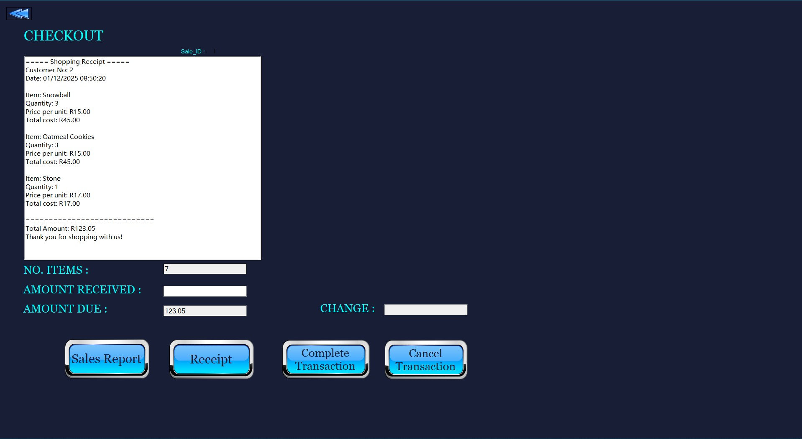

# Point of Sale System

A comprehensive Point of Sale (POS) system built with C# and ASP.NET Core, featuring real-time inventory management, customer tracking, and advanced sales analytics.

## Features

### Inventory Management
- Real-time stock monitoring
- Automatic low-stock alerts during transactions
- Stock level tracking for all products
- Inventory status notifications

### Customer Management
- Customer profile creation and storage
- Purchase history tracking
- Customer preferences analysis
- Quick lookup for returning customers

### Sales Analytics
- Weekly sales report generation
- Product popularity tracking
- Comparative analysis (weekly/monthly)
- Profit margin calculations
- Performance trend visualization

## Technology Stack

- **Backend**: C# with ASP.NET Core
- **Database**: SQL Server
- **Reporting**: Crystal Report Viewer
- **Development Environment**: Visual Studio

## Usage

[Screenshots to be added showing:]
- Main POS interface
- Inventory management screen
- Receipt Printer interface

## Reports

The system generates various reports including:
- Weekly sales summaries
- Product popularity metrics
- Profit comparison reports
- Inventory status reports

## Screenshot
 ### Main Interface

*Caption: The main Point of Sale interface showing the sales screen*

### Inventory Management
.jpg)
*Caption: Inventory management dashboard with stock levels*

###  Receipt Interface

*Caption: Receipt of newly purchased product by a customer*

## LINK TO THE PROJECT FILES!!

Sandile Allen Msezane
- GitHub: @sandileallenmsezane(https://github.com/sandileallenmsezane/Checkmate-Point-of-Sale-System-Frontend-project.git)
- LinkedIn: Sandile Msezane(https://linkedin.com/in/sandile-msezane)

